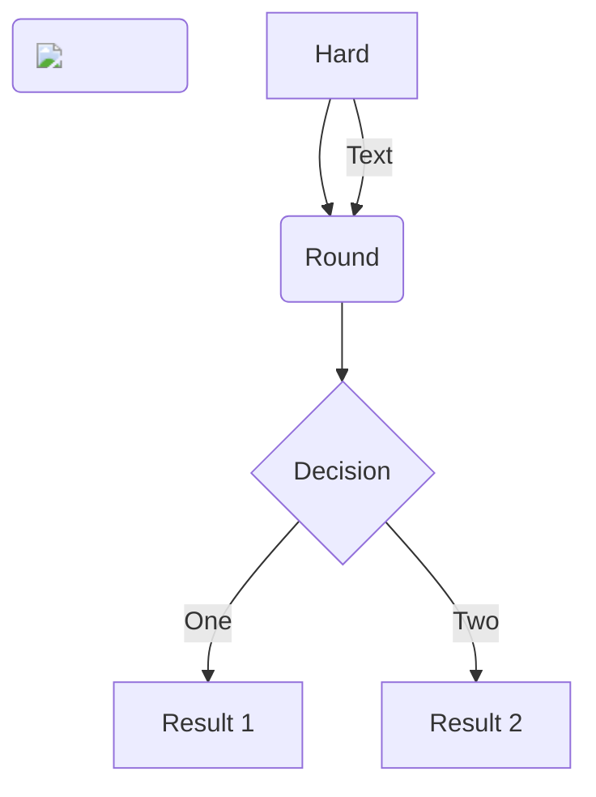
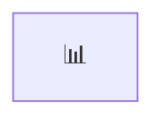
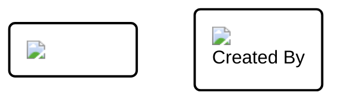

```mermaid
flowchart TB
DIR("<img src='https://iconscout.com/ms-icon-310x310.png'; width='30' />")

A --> B[<img src='https://iconscout.com/ms-icon-310x310.png' width='100' height='100'/>]

A[Hard] -->|Text| B(Round)
B --> C{Decision}
C -->|One| D[Result 1]
C -->|Two| E[Result 2]
```

```mermaid
graph LR
   UNICODE["📊"]
```

```mermaid
flowchart TB

%% Colors %%

classDef white fill:white,stroke:#000,stroke-width:2px,color:#000

classDef yellow fill:#fffD75,stroke:#000,stroke-width:2px,color:#000

%% Databases %%

DOCS("<img src='https://super.so/icon/dark/file-minus.svg'; width='40' />"):::white

%% Documents database %%

CREATEDBY("<img src='https://upload.wikimedia.org/wikipedia/commons/a/a9/Amazon_logo.svg' /> Created By"):::white
```
